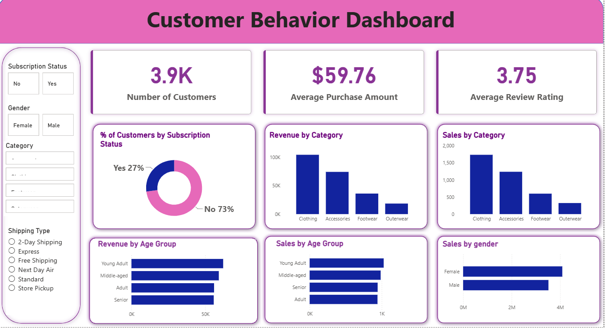

# Customer Behavior Analysis

A data analytics project focused on understanding customer purchasing behavior, spending patterns, preferences, and customer segments using Python, SQL, and Power BI.

The project transforms raw customer transaction data into meaningful business insights through data cleaning, exploratory data analysis, SQL analysis, and an interactive Power BI dashboard.

---

## 📌 Project Overview

Customer Behavior Analysis helps businesses understand how customers purchase products, how much they spend, which categories they prefer, and how different customer segments behave.

This project covers the complete data analytics workflow:

- Data Collection
- Data Cleaning
- Exploratory Data Analysis (EDA)
- Customer Segmentation
- SQL Analysis
- Data Visualization
- Business Insights
- Interactive Power BI Dashboard

---

## 🎯 Business Objectives

The main objectives of this project are to:

- Analyze customer purchasing patterns
- Understand customer spending behavior
- Identify popular product categories
- Analyze customer preferences
- Segment customers based on purchasing behavior
- Identify high-value and low-value customers
- Analyze purchase frequency and spending patterns
- Generate actionable business insights
- Support data-driven business decisions

---

## 🛠️ Tools & Technologies

### Programming & Analysis
- Python
- Pandas
- NumPy
- Matplotlib
- Seaborn
- Jupyter Notebook

### Database & Querying
- SQL
- MySQL

### Visualization
- Microsoft Power BI
- Power BI Dashboard
- Interactive Charts and Slicers

### Data Handling
- CSV
- Data Cleaning
- Data Transformation
- Exploratory Data Analysis

---

## 📂 Dataset

The project uses customer shopping behavior data containing information related to:

- Customer demographics
- Age
- Gender
- Product categories
- Purchase amount
- Purchase frequency
- Discounts
- Reviews and ratings
- Subscription status
- Shipping preferences
- Payment methods
- Previous purchases

---

## 🧹 Data Cleaning

The dataset was cleaned and prepared for analysis using Python.

Major data cleaning activities included:

- Handling missing values
- Removing duplicate records
- Correcting data types
- Standardizing categorical values
- Checking inconsistent data
- Preparing data for analysis
- Creating analysis-ready datasets

---

## 🔍 Exploratory Data Analysis

Exploratory Data Analysis was performed to identify important patterns and trends in customer behavior.

Analysis included:

- Customer demographics analysis
- Gender-wise purchasing analysis
- Age-group analysis
- Product category analysis
- Purchase amount analysis
- Customer spending patterns
- Purchase frequency analysis
- Subscription analysis
- Discount usage analysis
- Customer ratings analysis

---

## 🗄️ SQL Analysis

SQL was used to extract, transform, and analyze customer data.

Key SQL analysis included:

- Customer-level analysis
- Category-wise sales analysis
- Purchase behavior analysis
- Customer segmentation
- Spending analysis
- High-value customer identification
- Aggregation and filtering
- Business KPI calculations

---

## 📊 Power BI Dashboard

An interactive Power BI dashboard was developed to provide a consolidated view of customer purchasing behavior and business KPIs.

### Dashboard Highlights

- Total Customers
- Total Sales
- Average Purchase Amount
- Customer Spending
- Product Category Performance
- Gender-wise Analysis
- Age-group Analysis
- Subscription Analysis
- Purchase Frequency
- Customer Ratings
- Discount Analysis
- Customer Segmentation

### Dashboard Features

- Interactive slicers
- KPI cards
- Bar charts
- Column charts
- Donut charts
- Customer segmentation visuals
- Category-wise analysis
- Interactive filtering
- Business-focused visualizations

---

## 📸 Dashboard Preview



---

## 💡 Key Business Insights

The analysis helps identify:

- High-value customer segments
- Popular product categories
- Customer purchasing patterns
- Differences in spending behavior across customer groups
- Subscription and non-subscription customer behavior
- Frequently purchased products
- Customer preferences and trends
- Opportunities for targeted marketing campaigns

---

## 📈 Business Recommendations

Based on the analysis, businesses can:

- Target high-value customers with personalized offers
- Develop targeted marketing campaigns
- Improve customer retention strategies
- Promote popular product categories
- Create personalized recommendations
- Optimize discount strategies
- Focus on customer segments with higher purchase potential
- Improve customer engagement and loyalty programs

---

## 📁 Project Structure

```text
Customer-Behavior-Analysis/
│
├── customer_shopping_behavior.csv
├── customer_behavior_analysis.ipynb
├── customer_behavior_dashboard.pbix
├── customer_shopping_behavior.png
├── README.md
└── SQL_Analysis.sql
